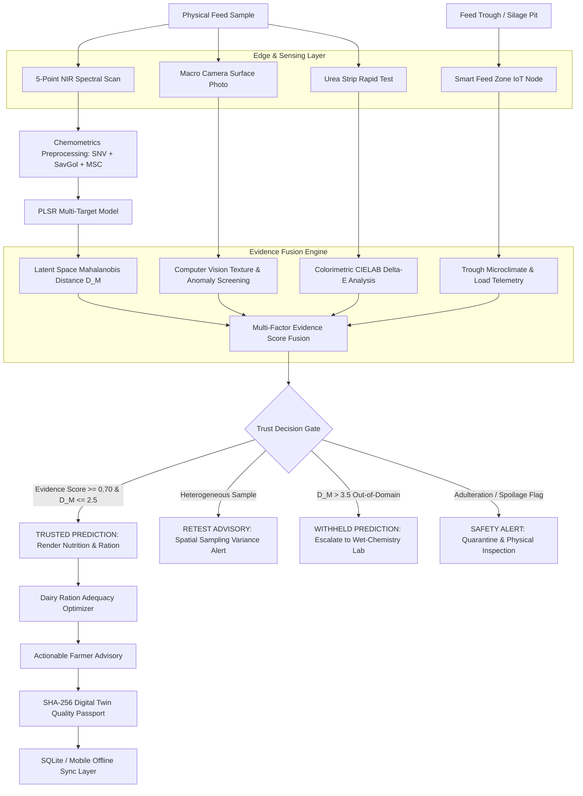

# FeedSure 360 — System Architecture

**Project:** SIH 2026 Problem Statement 26111  
**Full Title:** Adaptive Evidence-Fusion Intelligence for Rapid Feed & Silage Quality Assessment

---

## 1. High-Level Architecture Overview

FeedSure 360 is engineered as an **adaptive, evidence-aware feed and silage decision-support platform**. Unlike conventional black-box testing tools, FeedSure 360 incorporates an intelligent calibration gate: **it knows when its feed-quality prediction can be trusted, when confidence intervals must expand, and when evidence must be escalated.**

---

## 2. Core Architectural Components

### 2.1 Backend Engine (FastAPI + Python 3.12)
- **High-Performance Asynchronous API**: Modular RESTful architecture using FastAPI.
- **Chemometrics & Inference Pipeline**: Scikit-Learn PLSR regression combined with latent Mahalanobis distance calculator.
- **Persistence Layer**: Local SQLite database with Write-Ahead Logging (WAL) for offline-first resilience.
- **Authentication & RBAC**: JWT token issuance with PBKDF2-HMAC-SHA256 password security and role-tailored authorization.

### 2.2 Frontend Web Application (Next.js 14 + React 18 + Tailwind CSS)
- **Interactive Multi-Mode Dashboard**: Seamless toggle between Simplified Farmer Mode and Technical Expert Mode.
- **Real-Time Data Visualization**: Recharts integration for spectral curves, spatial CV heatmaps, 5-metric radar charts, and trough microclimate trends.
- **Digital Twin Passport**: Cryptographic SHA-256 hash verification with interactive QR code rendering for on-field auditability.

### 2.3 Mobile Companion Application (Flutter + Dart)
- **Offline-First Resilience**: SharedPreferences-backed offline request queuing for network-disconnected rural barns.
- **Camera & Vision Integration**: Instant photo capture of fodder face and colorimetric urea test strips.
- **Multi-Lingual Localization**: English, Hindi (हिंदी), and Marathi (मराठी) support.

### 2.4 Smart Feed Zone Node (IoT Edge Layer)
- **Embedded MCU**: ESP32 dual-core 240MHz with Wi-Fi & BLE.
- **Sensors**: DHT22/SHT31 (Temperature & Relative Humidity) + HX711 24-bit ADC with load cell for feed quantity monitoring.
- **Automated Alerts**: Early detection of aerobic deterioration in feed bunks and silage pits.
